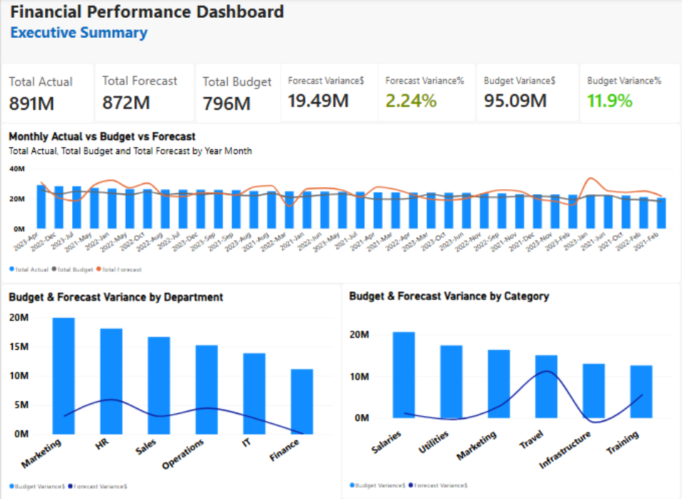
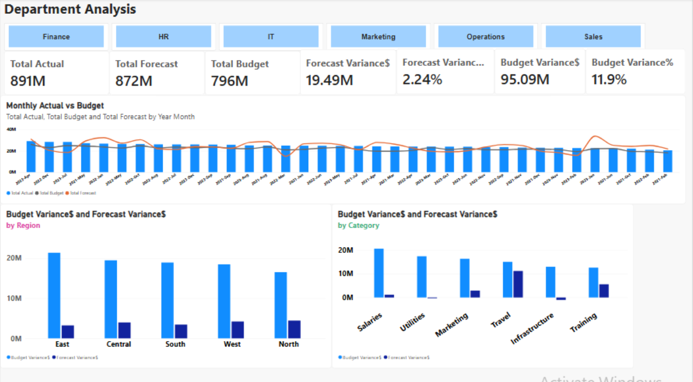
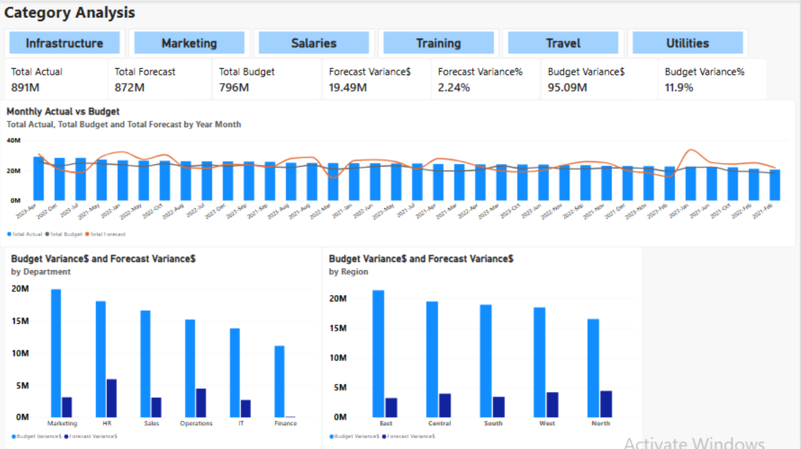
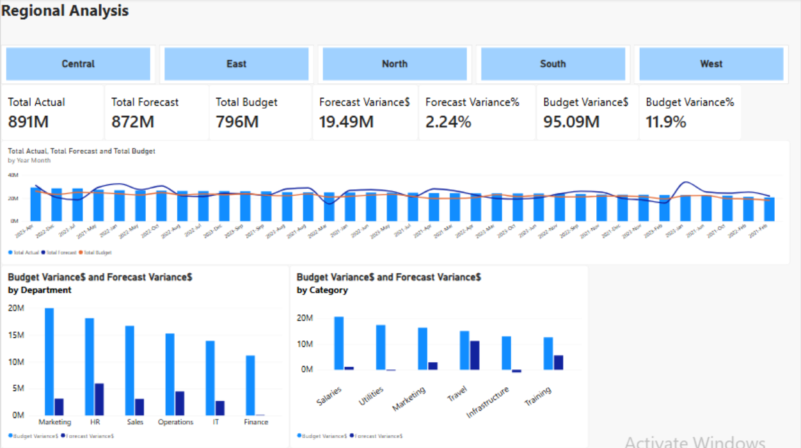
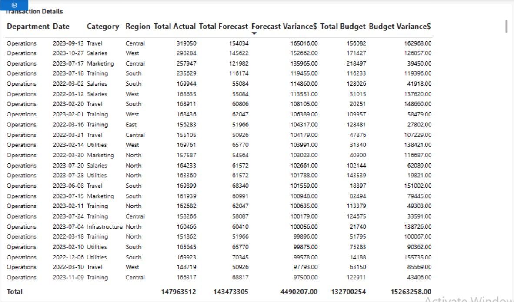
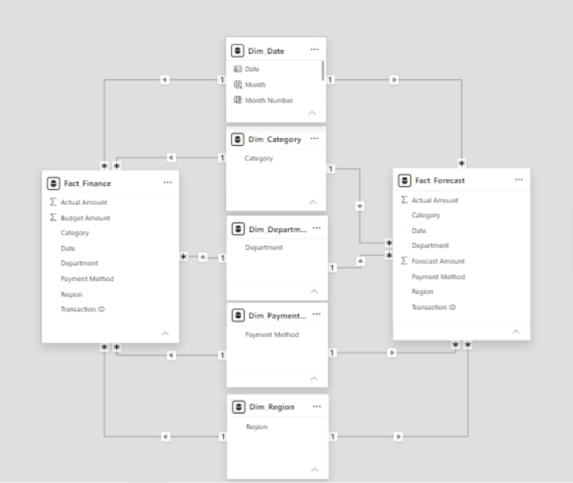

# Financial Performance Dashboard

## Project Overview

This project demonstrates the development of an interactive Power BI dashboard for analysing financial performance across departments, categories and regions.

The dashboard compares Actual, Budget and Forecast results and provides management with a clear view of financial performance and key variances.

---

## Dashboard Pages

### Executive Summary

Provides a high-level overview of financial performance using KPI cards, monthly trends and variance analysis.

---

### Department Analysis

Allows users to analyse financial performance by department and compare budget and forecast variances.

---

### Category Analysis

Displays financial performance across spending categories with variance comparisons.

---

### Regional Analysis

Shows financial performance by region and enables regional comparison.

---

### Transaction Detail

Provides detailed transaction-level information for further investigation.

---

### Data Model

The dashboard is built using a star schema with separate fact and dimension tables to support efficient reporting and DAX calculations.

---

## Key Features

- Interactive dashboard with slicers
- KPI cards
- Actual vs Budget vs Forecast comparison
- Budget and Forecast variance analysis
- Monthly trend analysis
- Star schema data model
- Drill-through transaction detail page

## Tools Used

- Power BI Desktop
- Power Query
- DAX
- Data Modelling
- Data Visualisation
